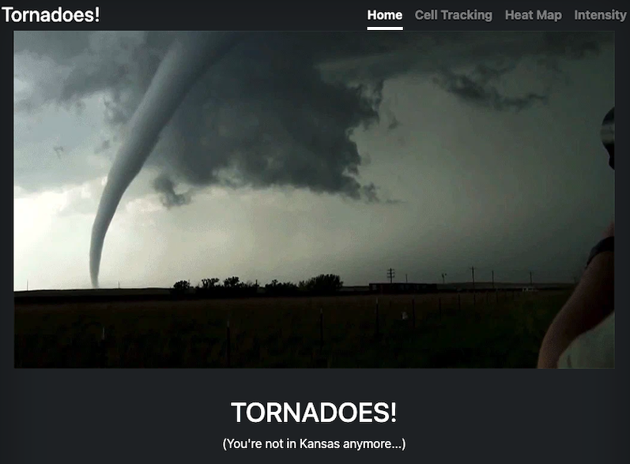
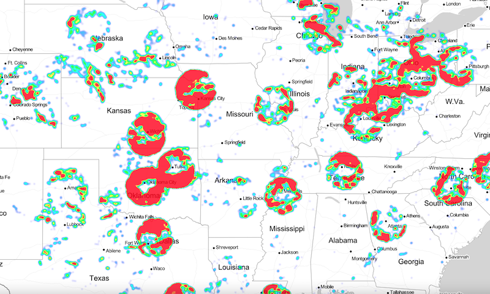

# Tornados!

## Group Members:

- Taylor Bohl
- Harish Korrapati
- Corey Lawson-Enos
- Rhiana Schafer
- Ishanjit Sidhu

## Description:
Extracted NEXRAD Level-3 Radar data identifying Tornado Vortex Signatures from the last two months (source NOAA: www.ncdc.noaa.gov.) Cleaned and organized in Pandas, tornado cell activity data is subsequently launched to MongoDB for storage. Python Flask API powers web application for dynamic interaction with tornado data (see file app.py). Visualizations created using Leaflet and Plotly.

## Dataset:

Data was retrieved using the below API. 

https://www.ncdc.noaa.gov/swdiws/

Some notes on the data:  
- We retained the following columns:  
&nbsp;&nbsp;&nbsp;&nbsp;Cell_Type: Type of rotation, TVS indicates tornado  
&nbsp;&nbsp;&nbsp;&nbsp;Shape: Point (lon, lat)  
&nbsp;&nbsp;&nbsp;&nbsp;Max_Shear: Change in wind speed and/or direction with height  
&nbsp;&nbsp;&nbsp;&nbsp;WSR_ID: ID of the data collecting tower/radar  
&nbsp;&nbsp;&nbsp;&nbsp;MXDV: Maximum Delta-Velocity describes intensity of storm  
&nbsp;&nbsp;&nbsp;&nbsp;Cell_ID: ID of the storm  
&nbsp;&nbsp;&nbsp;&nbsp;zTime: Measure of time used in meterology  
&nbsp;&nbsp;&nbsp;&nbsp;Azimuth: Angular direction of storm, in degrees  
&nbsp;&nbsp;&nbsp;&nbsp;Range: Distance between torndao and data collecting tower/radar 

- We added the following columns:  
&nbsp;&nbsp;&nbsp;&nbsp;Latitude  
&nbsp;&nbsp;&nbsp;&nbsp;Longitude  
&nbsp;&nbsp;&nbsp;&nbsp;Primary Key combining Cell_ID and date  
&nbsp;&nbsp;&nbsp;&nbsp;Date  
&nbsp;&nbsp;&nbsp;&nbsp;Time  
&nbsp;&nbsp;&nbsp;&nbsp;Year  
&nbsp;&nbsp;&nbsp;&nbsp;Month  

## Visuals:

### Landing page:

### Storm Tracking:
On the Cell Tracking page, you can view tornado instances based on date, as well as their movement throughout the day using the slider.

### Heat Map:
On the Heat Map page, you'll see all of the data points plotted to show the density of the storms in particular areas.

### Intensity Plots:
On the Intensity page, you'll see the relationship between Max Shear, MXDV and date.

